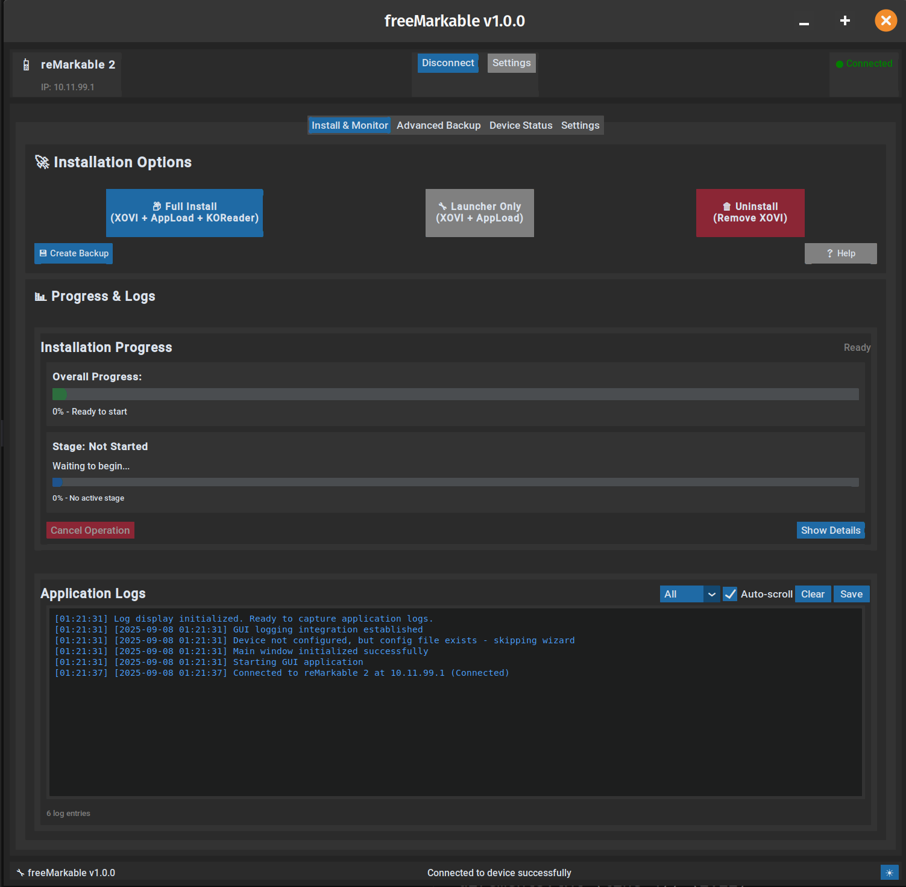

# freeMarkable



**Python GUI for installing XOVI on reMarkable devices**

Python GUI application for installing XOVI+AppLoad on **all reMarkable devices**, including the new **reMarkable Paper Pro**. Features automatic device detection, graphical interface, and backup system for safe installations.

## NEW: reMarkable Paper Pro Support

**freeMarkable now supports the new reMarkable Paper Pro with full 64-bit architecture detection!**

- **Automatic Device Detection** - Detects reMarkable 1, 2, and Paper Pro automatically
- **Architecture-Aware Installation** - Uses correct 32-bit or 64-bit binaries based on device
- **Seamless Experience** - Same interface works for all reMarkable generations
- **Future-Ready** - Built to support new reMarkable devices as they're released

## Supported Devices

| Device | Architecture | Binary Type | Status |
|--------|-------------|-------------|---------|
| **reMarkable 1** | armv6l | 32-bit ARM |  Fully Supported |
| **reMarkable 2** | armv7l/armhf | 32-bit ARM |  Fully Supported |
| **reMarkable Paper Pro** | aarch64/arm64 | 64-bit ARM |  Fully Supported |

## Features

- **Universal Device Support** - Works with reMarkable 1, 2, and Paper Pro
- **Smart Architecture Detection** - Automatically detects device type and uses appropriate binaries
- **GUI Interface** - Built with CustomTkinter for cross-platform compatibility
- **Complete XOVI Installation** - Full framework with proper tmpfs overlay activation
- **AppLoad Integration** - Application launcher system for reMarkable devices
- **KOReader Installation** - Popular eBook reader with full integration
- **Automatic Backup & Restore** - System backups created before any modifications
- **Connection Management** - Easy device setup with configuration wizard
- **Real-time Progress Tracking** - Live installation progress with detailed logging
- **Cross-Platform Support** - Works on both Linux and Windows systems
- **Error Recovery** - Comprehensive error handling and recovery options

## System Requirements

- **Python 3.10 or higher** installed on your system
- **reMarkable device** (any generation: 1, 2, or Paper Pro) with SSH access enabled
- **USB or WiFi connection** to your reMarkable device
- **Internet connection** for downloading required components

## Installation & Usage

### Linux Users
```bash
chmod +x launch.sh
./launch.sh
```

### Windows Users
```cmd
launch.bat
```
(or simply double-click the launch.bat file)

The launcher scripts will automatically:
1. Check for Python installation
2. Install required Python dependencies
3. Launch the freeMarkable application

## First Time Setup

1. Run the appropriate launcher script for your operating system
2. Complete the initial setup wizard to configure your reMarkable connection
3. Test the connection to ensure proper communication with your device
4. **Device Auto-Detection** - The app will automatically detect your device type (RM1/RM2/Paper Pro)
5. Choose your installation type (Full installation or Launcher-only)
6. Follow the on-screen instructions to complete the installation

## Technical Details

### Architecture Detection

freeMarkable uses hardware-level architecture detection to identify your reMarkable device:

- **SSH-Based Detection** - Connects to device and runs `uname -m` to get CPU architecture
- **Automatic Binary Selection** - Downloads correct binaries based on detected architecture
- **No Manual Configuration** - Device type detection is completely automatic

### Binary Compatibility

The application automatically selects the correct binaries for your device:

**reMarkable 1/2 (32-bit ARM):**
- XOVI Extensions: `extensions-arm32-testing.zip`
- AppLoad: `appload-arm32.zip`
- XOVI Binary: `xovi-arm32.so`
- KOReader: Standard reMarkable build

**reMarkable Paper Pro (64-bit ARM):**
- XOVI Extensions: `extensions-aarch64.zip`
- AppLoad: `appload-aarch64.zip` 
- XOVI Binary: `xovi-aarch64.so`
- KOReader: Architecture-specific aarch64 build

## Project Structure

```
freeMarkable/
├── launch.sh              # Linux launcher script
├── launch.bat             # Windows launcher script  
├── README.md              # Documentation (this file)
├── LICENSE                # Project license
├── image.png              # Application screenshot
└── resources/             # Core application files
    ├── main.py            # Application entry point
    ├── requirements.txt   # Python dependencies
    └── remarkable_xovi_installer/
        ├── gui/           # User interface components
        ├── services/      # Core installation services
        ├── models/        # Data models and device detection
        ├── utils/         # Utility functions and helpers
        └── config/        # Application configuration
```

## Ready for Use

freeMarkable supports all reMarkable devices with reliable installations. Features include:

- **Tested Installation Process** - Successful XOVI installations across device types
- **Device Coverage** - Full support for all reMarkable generations including Paper Pro
- **Error Handling** - Backup and recovery systems
- **Cross-platform** - Works on Linux, Windows, and macOS
- **Active Development** - Regular updates with bug fixes and improvements

## Recent Updates

**v1.0.9**: Major reliability improvements and cross-platform fixes
- **KOReader Detection Fix**: Resolved detection issues for proper installation status reporting
- **macOS SSL Support**: Added SSL compatibility for seamless macOS operation
- **Enhanced Stability**: Improved error handling and connection reliability

**v1.0.8**: CodexCtl panel lockout during rewrite phase
- **UI Updates**: Clean interface messaging during system updates
- **Backup System**: Enhanced pruning and management features

## Contributing

freeMarkable welcomes contributions from the community. If you encounter issues or have suggestions for improvements, please report them through the project's issue tracker.

We especially appreciate feedback from users across all reMarkable device generations to ensure continued compatibility and performance.

## Safety & Backups

freeMarkable includes backup systems for device safety. The application automatically creates device backups before any modifications, allowing you to restore your device to its original state.

**Safety Features:**
- **Automatic Backups**: Created before every installation
- **Backup Management**: Easily manage and restore from previous backups
- **Reversible Installation**: Complete uninstall option available
- **Error Recovery**: Error handling with safe fallback options

Always ensure your reMarkable device is adequately charged during installation processes.

## License

This project is licensed under the terms specified in the LICENSE file.

---

**freeMarkable** - XOVI installation made simple and safe for all reMarkable devices.
